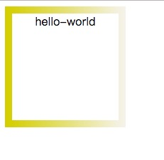
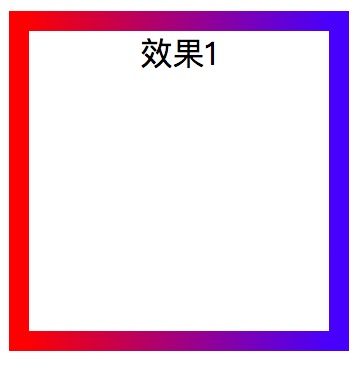
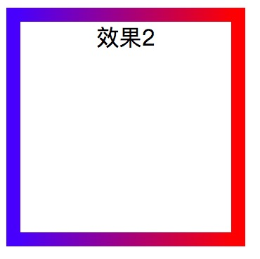
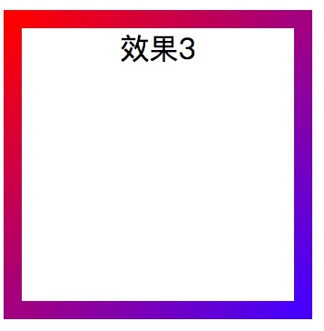
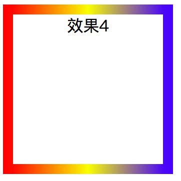
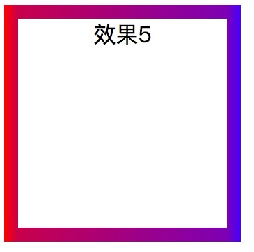
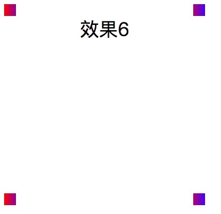

  css3边框纵向渐变，网上的介绍并不多。亲测之后记录一下自己的心得。
----
  先上效果图：


  代码如下：
 ```
 <!DOCTYPE html>
 <html lang="en">
  <head>
	<meta charset="UTF-8">
	<title>Document</title>
  </head>
  <style type="text/css">
	.box {
		text-align: center;
        width: 150px;
        height: 150px;
        border: 10px solid;
		border-image:-webkit-linear-gradient(left, rgb(214, 200, 8) , rgb(245,242,233) ) 5;
	}
  </style>
  <body>
	<div class="box">hello-world</div>
  </body>
  </html> 

 ```

------


语法:
`border-image:-webkit-linear-gradient(angle,color1,color2..colorN) Num1 Num2 Num3 Num4`
 
`angle`表示渐变的角度，可以用角度`deg`,也可以用英文的方向`left,right,top,bottom`及其组合来表示。
颜色可以根据自己需求选择多种。
最后的`Num`必须是数字，用来调节颜色渐变程度。具体意义我也没搞清楚，如果懂了再补充。只知道不能超过4个，至少1个。以及数值不明显超过容器的宽高即可正常显示效果。
值得注意的是，`webkit`必须加，而不是根据浏览器不同内核而更换。测试结果除了低版本ie显示有问题，其他新版浏览器都支持。

-----

  下面贴几个不同参数的效果图：

效果1:`border-image:-webkit-linear-gradient(left,red,blue) 5`


效果2:`border-image:-webkit-linear-gradient(right,red,blue ) 5`


效果3:`border-image:-webkit-linear-gradient(lef top,red,blue) 5`


效果4:`border-image:-webkit-linear-gradient(left,red,yellow,blue) 5`


效果5:`border-image:-webkit-linear-gradient(left,red,blue) 100 `


效果6:`border-image:-webkit-linear-gradient(left,red,blue) 200 `



