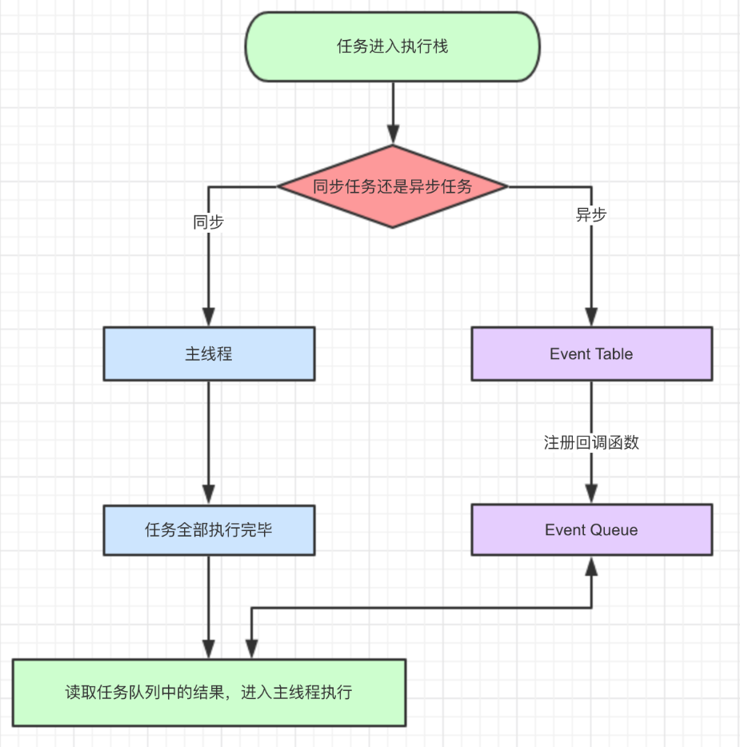
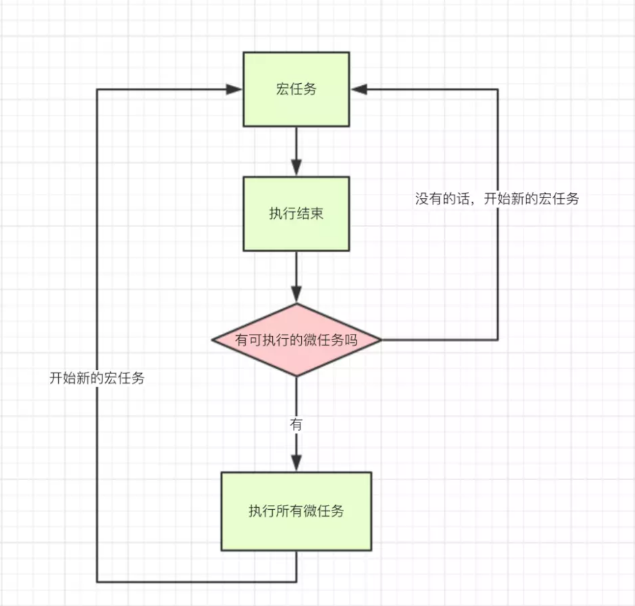

# 前言
简单介绍一下Javascript执行的机制，加深对该语言的理解。能够在开发的时候更好的去处理运行逻辑。

# 进程和线程
简单来说，一个独立运行的程序比如浏览器可以叫做一个进程。进程下面可以多个同时执行，共享空间地址的可以叫做线程。

进程和线程之间的最大区别就是，进程与进程之间相互独立，不会互相影响。而线程之间可以共用一个空间地址，能够互相影响。


# 执行栈
也是其他语言中的`调用栈`。可以类比为一个单口容器，是一种后进先出数据结构的栈，被用来存储代码运行时的环境(也叫执行上下文)。
# Javascript事件循环
Javascript是一门`单线程`语言。即同一时间只能做一件事情。所谓的`多线程`都是通过`单线程`模拟出来的。

单线程意味着所有任务需要排队。前一个任务结束，下一个任务才能执行。如果其中一个任务执行时间过长，或者执行错误，会直接导致后面的任务一直无法执行。

## 同步异步以及事件循环
由于IO设备输入输出(比如网络请求,设备信息传输等)都比较慢，每次都等待他们执行完毕后再往下执行的话，会严重影响性能。

因此语言的设计者将执行栈中的任务分成了两种：`同步任务`和`异步任务`。其实这就是我们平时所理解的同步异步操作。同步异步任务如何执行可以看下面简易流程图：



`同步任务`在`主线程`上排队执行，只有前一个任务执行完毕后一个任务才能继续执行。全部执行完毕后，读取任务队列中的

`异步任务`通过`Event Table`注册回调函数成功后(也就是异步任务执行有了结果)，进入`任务队列(task queue)`等待。直到`主线程`上的同步任务全部执行完毕，`任务队列`里面等待的`异步任务`才会进入主线程执行。

上述过程会不断重复，也就是常说的Event Loop(事件循环)。


### 宏任务和微任务
 为了更好地区分不同类型任务，分为`宏任务`和`微任务`。
`宏任务(macro task)`可以理解为每次执行栈中执行的代码就可以视为一个`宏任务`。所谓`同步任务`也是`宏任务`。
`微任务(micro task)`可以简单理解为存在于两个`宏任务`之间的。即`微任务`始终是在上一个`宏任务`执行完毕,下一个`宏任务`执行之前这个阶段执行。因此在当前`微任务`执行完成之前，是不会执行下一个`宏任务`。`微任务`都是异步任务。

两者执行关系如下示意图:


常见的`宏任务`,`微任务`见下表：

|        宏任务         | 浏览器 | node |
|:---------------------:|:------:|:----:|
|   script(整体代码)    |   √    |  √   |
|          I/O          |   √    |  √   |
|      setTimeout       |   √    |  √   |
|      setInterval      |   √    |  √   |
| requestAnimationFrame |   √    |  ×   |
|     setImmediate      |   ×    |  √   |

----

|      微任务      | 浏览器 | node |
|:----------------:|:------:|:----:|
| process.nextTick |   ×    |  √   |
| MutationObserver |   √    |  ×   |
|  Object.observe  |   √    |  √   |
|   Promise.then   |   √    |  √   |


进一步补充上述的EventLoop事件循环:

1.执行一个宏任务（栈中没有就从事件队列中获取）

2.执行过程中如果遇到微任务，就将它添加到微任务的任务队列中

3.宏任务执行完毕后，立即执行当前微任务队列中的所有微任务（依次执行）

4.当前宏任务执行完毕，开始检查渲染，然后GUI线程接管渲染

5.渲染完毕后，JS线程继续接管，开始下一个宏任务（从事件队列中获取）


上面一个完整的事件循环又叫做一个tick。下面介绍一下vue中的nextTick。
# vue中的nextTick
nextTick 是 Vue 的一个核心实现。

其实现原理：
1.创建一个callbacks数组。
2.使用时调用nextTick方法，该方法将需要执行的函数压入callbacks数组中。
3.封装了一个叫timeFunc的函数，使callbacks数组中的函数在下一个tick时被调用


一般使用场景是：
 比如从服务端接口去获取数据的时候，数据做了修改，如果我们的某些方法去依赖了数据修改后的 DOM 变化，我们就必须在 nextTick 后执行。比如下面的伪代码：
```
getData(res).then(()=>{
  this.xxx = res.data
  this.$nextTick(() => {
    // 这里我们可以获取变化后的 DOM,如获取内容或者元素等
  })
})
```
