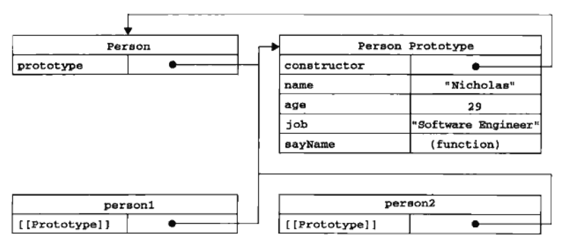

### 什么是原型对象
在Javascript中，只要创建了一个新的函数，该函数就会拥有一个prototype属性，这个属性是一个纸箱函数的原型对象。原型对象的用途是包含可以由特定类型的所有实例共享的属性和方法。<!-- more -->

### 什么是原型链
当调用构造函数创建一个新实例后，该实例的内部将包含一个指针，指向构造函数的原型对象。ECMAScript5中叫`[[Prototype]]`，在Firefox，Safari、Chrome中又叫`_proto_`(原型链)。
需要注意的是，这个连接存在于实例与构造函数的原型对象之间，而并非实例与构造函数之间。

### 图解原型对象和原型链的区别
```
function Person(name,age,job){
  this.name=name
  this.age=age
  this.job=job
  this.sayName=function(){
    alert(this.name)
  }
  var person1=new Person('Nicholas','29','software Engineer')
  var person2=new Person()

  alert(person1.name) //'Nicholas' 来自实例
  alert(person2.name) //'undefined' 原型中并无该属性
}
```
以上面代码为基础，下图展示展示各对象之间的关系：

如图所示，`Person.prototype`和`person1.[[Prototype]]`、`person2.[[Prototype]]`均指向了原型对象`Person Prototype`。而`Person Prototype.constructor`则又指回了构造函数`Person`。
同时可以看出，实例person1和person2与构造函数Person并无直接联系。并且[[prototype]]无法访问到，只能使用isPrototypeOf()方法来确定对象之间是否存在这种关系。如下：
```
alert(Person.prototype.isPrototypeOf(person1))  //true
alert(Person.prototype.isPrototypeOf(person2))  //true
```
另外`prototype`是只有函数才有的属性，`[[Prototype]]`是每个对象都有的属性。

### 原型对象工作原理
每当代码读取某个对象某个属性时，都会进行搜索。首先从对象实例本身开始，如果找到即返回该值。如果没有找到，则搜索原型对象，如果在原型对象中找到，即返回该属性值。
因此我们在读取某对象某个属性时，可能会执行两次搜索，而通过第二次的搜索可以实现实例访问保存在原型对象中的值。

另外，通过构造函数创建的实例是通过其原型链[[Prototype]]定位到原型的，如果更改了原型对象，则无法定位到原型，可以参照如下代码体会下：
```
function Person(){}
Person.prototype={
  'constructor':Person,
  'name':'lucy',
  'age':28
}

let person1=new Person()
let person2=new Person()
Person.prototype={
  'constructor':Person,
  'name':'jack',
  'age':28,
  'job':'teacher'
}
let person3=new Person()
console.log(person1.name)     //jack来自最初的原型对象
console.log(person2.name)     //jack来自最初的原型对象
console.log(person2.job)      //undefined重写原型对象后，person2并不能访问到
console.log(person3.job)    //teacher重写后定义的实例可以访问到
```