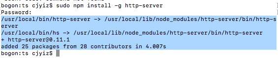
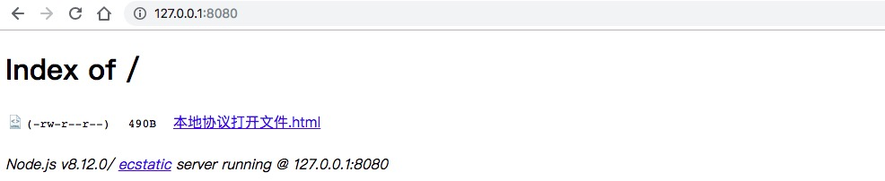

***导语：***
   我们直接打开html本地文件，是以file协议打开。但是有时候file协议并不能满足一些开发需求。比如以symbol方式引入的iconfront图标，在file协议下，并不能正常显示。这种时候可以使用http本地服务打开html文件进行开发。

----
  简单做个例子，用symbol方式引用iconfront图标，代码如下图：

  效果如下，并没有显示出图标：

  下面我们使本地http服务启用，需要安装一个小插件。
  打开命令行，输入`npm install -g http-server`,回车运行。出现下图中蓝色区域信息，即表示安装完成。

  Mac如果需要权限，在命令前面加`sudo`。

  安装好后，启动服务。首先切换到需要打开文件的目录，输入`http-server`后回车。启动服务，启动成功后会出现两个地址。

  在浏览器中随便打开一个。你会看到文件目录下的文件。

   最后一步，点击你需要打开的文件，网页跳转成功后即可正常预览。如下图，引用的爱心图标正常显示。

